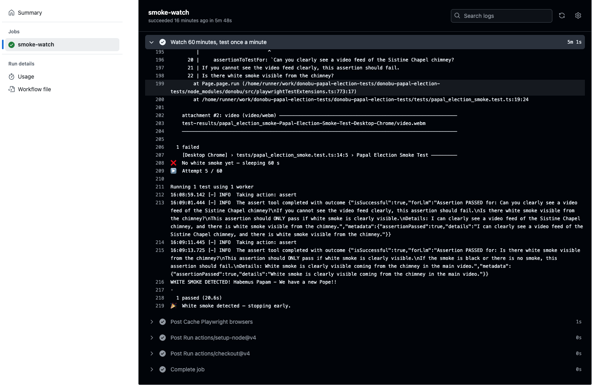

# Donobu Papal Election Smoke Test Demo

A minimal demo using the Donobu NPM library to run an autonomous smoke test that checks for white smoke from the Sistine Chapel chimney during a papal election.

---

## Prerequisites

* Node.js v20 or later
* Playwright browsers installed (`npx playwright install --with-deps`)
* `GOOGLE_GENERATIVE_AI_API_KEY` and `GOOGLE_GENERATIVE_AI_MODEL_NAME` for generative assertions

---

## Installation

```bash
# Clone and enter repo
git clone https://github.com/donobu-inc/donobu-papal-election-tests.git
cd donobu-papal-election-tests

# Install deps and browsers
npm ci
npx playwright install --with-deps
```

---

## Running Tests

Add your smoke test script in `tests/papal_election_smoke_test.ts`. Then run:

```bash
npm test    # runs `npx playwright test`
```

---

## CI with GitHub Actions

A scheduled workflow runs the smoke test up to 60 times, stopping early on white smoke detection. See `.github/workflows/tests.yaml` for schedule and steps.

---

## Video Demo


[View full video](demo/test_authoring_demo.mp4)

---

## Logs Screenshot of Passing Test



---

Feel free to adjust schedules, timeouts, or assertion details to suit your own conclave watch.

